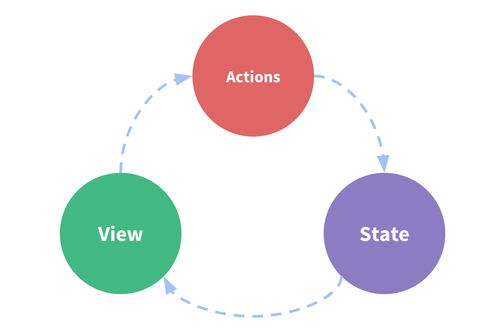

# Redux Overview

## What is Redux?

Redux is a pattern and library for managing and updating application state, using events called "actions".

## Why Should I Use Redux?

The patterns and tools provided by Redux make it easier to understand when, where, why, and how the state in your application is being updated, and how your application logic will behave when those changes occur.

## When Should I Use Redux?

You should consider using Redux when:

- You have large amounts of application state that are needed in many places in the app.
- The app state is updated frequently over time.
- The logic to update that state may be complex.
- The app has a medium or large-sized codebase, and might be worked on by many people.

## Redux Terms and Concepts

### State Management

A Redux application is a self-contained app with the following parts:

- The state, the source of truth that drives our app.
- The view, a declarative description of the UI based on the current state.
- The actions, the events that occur in the app based on user input, and trigger updates in the state.

This represents a "one-way data flow":

- State describes the condition of the app at a specific point in time.
- The UI is rendered based on that state.
- When something happens (such as a user clicking a button), the state is updated based on what occurred.
- The UI re-renders based on the new state.




## Immutability

"Mutable" means "changeable". If something is "immutable", it can never be changed.

In order to update values immutably, your code must make copies of existing objects/arrays, and then modify the copies.

Redux expects that all state updates are done immutably


## Terminology

### Actions
An action is a plain JavaScript object that has a type field. You can think of an action as an event that describes something that happened in the application. (domain/eventName)

An action object can have other fields with additional information about what happened. By convention, we put that information in a field called payload.

```typescript
const addTodoAction = {
  type: 'todos/todoAdded',
  payload: 'Buy milk'
}
```

### Action Creators
An action creator is a function that creates and returns an action object. We typically use these so we don't have to write the action object by hand every time:

```typescript
const addTodo = text => {
  return {
    type: 'todos/todoAdded',
    payload: text
  }
}
```

### Reducers
A reducer is a function that receives the current state and an action object, decides how to update the state if necessary, and returns the new state: (state, action) => newState. You can think of a reducer as an event listener which handles events based on the received action (event) type.

Reducers must always follow some specific rules:
- They should only calculate the new state value based on the state and action arguments
- They are not allowed to modify the existing state. Instead, they must make immutable updates, by copying the existing state and making changes to the copied values.
- They must not do any asynchronous logic, calculate random values, or cause other "side effects"


### Store
The current Redux application state lives in an object called the store .


### Dispatch
The Redux store has a method called dispatch. The only way to update the state is to call store.dispatch() and pass in an action object. The store will run its reducer function and save the new state value inside, and we can call getState() to retrieve the updated value

### Selectors
Selectors are functions that know how to extract specific pieces of information from a store state value. 


## Redux Application Data Flow

For Redux specifically, we can break these steps into more detail:

Initial setup:
- A Redux store is created using a root reducer function
- The store calls the root reducer once, and saves the return value as its initial state
- When the UI is first rendered, UI components access the current state of the Redux store, and use that data to decide what to render. They also subscribe to any future store updates so they can know if the state has changed.
Updates:
- Something happens in the app, such as a user clicking a button
- The app code dispatches an action to the Redux store, like dispatch({type: 'counter/increment'})
- The store runs the reducer function again with the previous state and the current action, and saves the return value as the new state
- The store notifies all parts of the UI that are subscribed that the store has been updated
- Each UI component that needs data from the store checks to see if the parts of the state they need have changed.
- Each component that sees its data has changed forces a re-render with the new data, so it can update what's shown on the screen
Here's what that data flow looks like visually:


